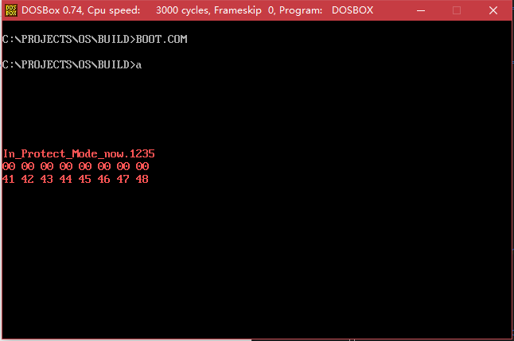

# EOS

## 进度

三个进程切换，完全均匀调度。

## 参考的资料

[参考的资料](./doc/readme.md)

## install bochs

use apt

```shell
sudo apt install bochs
sudo apt install bochs-x
```

## 直接运行

```shell
make run
```

在bochs的shell中，输入 `c` 。

## build img

1. `make`

## build com

1. ```make boot.com```
1. 使用任意方法通过dos执行

## 通过X11远程执行

mac上执行

```shell
# bochs加载rom依赖的相对路径，所以需要修改执行的base。
ssh -X user@ip "cd /path/to/eos/ && bochs -f ./boot.bxrc"
```

## 遇到的问题

### 保护模式

1. **no bootable device** 就是生成的镜像里面 没有符合约定的将510处置为0xaa55
1. **mount failed unknown error** <del>我使用的是win10的ubuntu子系统 *16.04*，生成的img没法成功挂载。没能解决，我通过使用 **dosbox** 来模拟了dos环境，直接运行了生成的com， 效果拔群。</del> **dosbox不支持中断15h 来读取内存** 我通过租的服务器来实现了挂载写入，最后还是用了bochs。


### 编译问题

1. **ld: i386 架构于输入文件 kernel/kernel.o 与 i386:x86-64 输出不兼容** 64-bit的gcc会导致格式问题,在gcc的编译选项中添加```-m32```解决
1. **对‘__stack_chk_fail’未定义的引用** 原因未知, 解决方案是gcc编译选项中添加```-fno-stack-protector```解决 _(强制忽略堆栈保护检查)?_

### kernel中的disp_str 回车后 乱码

在处理回车的逻辑中没有保护bl,如果使用堆栈保护了ebx之后问题消除

[io.asm](./lib/io.asm)
